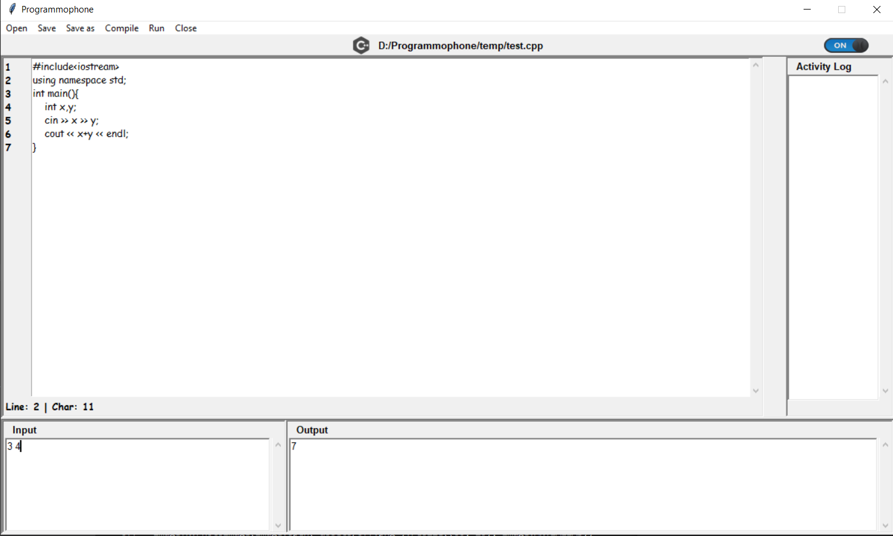

# Programmophone
## _The IDE with Voice Recognition_
Team Name: Kryptonites

<p align="center">
</p>

<a href="https://woc2k21.github.io/">  </a>


## Introduction:
- Programmophone is a tool to program with speech and is intended to be used by sightless, who have significantly less or no option to program.

- It aims at providing complete hands free experience with programming which would specifically benefit those who are visually challenged.

- Supports all popular programming languages such as C++, Java, Python
  
- Can be used by both regular programmers and those with visual impairment

- Supported OS: Windows 7/8/10/11 

## Installation

Git cloning the repository
```
git clone https://github.com/kunal2812/Programmophone
```
Installing all dependencies in requirements.txt
```
pip install -r requirements.txt
```
Go to the directory in which files like app.py, cursor_utils.py etc. are placed and run the following command
```
python app.py
```
OR
```
python3 app.py
```
## Technology Stack:
  1) Tkinter
  2) SpeechRecognition
  3) Tensorflow
  3) subprocess
  4) pyttsx3
  5) threading

## Presentation Link:
  <a href="https://docs.google.com/presentation/d/1N1-8xPaULpoOqlEtqVsVmkClGOwFKV0gymYr4FAgCko/edit?usp=sharing">Presentation Link</a>
  
## Manual and instructions Link:

  _In files above_

## Screenshots



## Dataset Link:
  <a href="https://drive.google.com/drive/folders/1m0qeN1g32a7GKmeWt11A0XeGnlGqvBBh?usp=sharing">Dataset Link</a>
  
Small dataset that we created with the help of our friends

* [Praveen Saraswat](https://github.com/SaraswatPraveen)
* [Awanish Singh](https://github.com/ak-1-1)
* [Ravi Kumar](https://github.com/#)
 
## Mentor:

Special thanks to our mentor for giving us new ideas and motivating us to explore.

* [Shashwat Pandey](https://github.com/shashwat1998)

## Contributors:

* [Kunal Katiyar](https://github.com/kunal2812)
* [Shashank Shekhar](https://github.com/shashank8987)

## License:

MIT

<a href="https://woc2k21.github.io/">  </a>